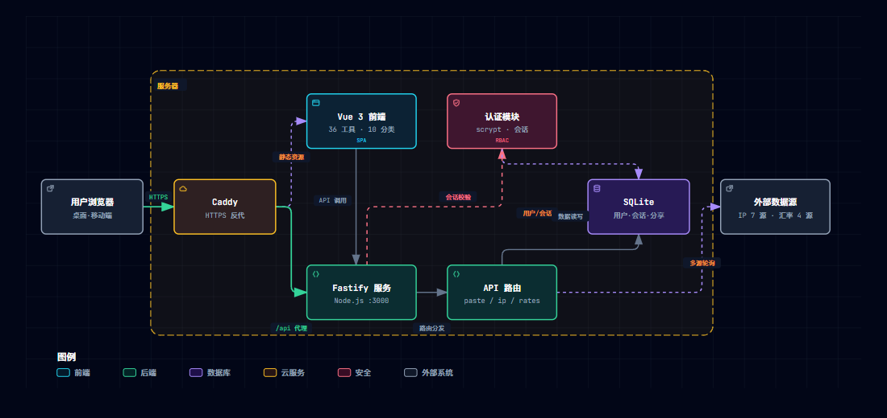

<div align="center">

# IT Tools · 开发者工具箱

**自部署、隐私优先的开发者在线工具箱**

36 个工具 · 10 个分类 · 前后端一体，开箱即用

[](https://vuejs.org/)
[](https://www.typescriptlang.org/)
[](https://vite.dev/)
[](https://tailwindcss.com/)
[](https://fastify.dev/)
[](https://github.com/WiseLibs/better-sqlite3)
[](https://nodejs.org/)
[](./LICENSE)

</div>

一个运行在你自己设备上的开发者工具站：编解码、JSON、生成器、网络诊断、隐私检测一应俱全。数据只存在你自己的设备上，不上传、不追踪。

## 特性

- **36 个工具，10 大分类**：JSON / 编解码 / 生成器 / 哈希 / 时间 / 文本 / 转换器 / 网络工具 / 隐私检测 / 分享服务
- **隐私优先**：28 个纯前端工具全部在浏览器本地执行，数据不离开设备；页面均标注「仅本机处理」
- **多源负载均衡**：IP 归属地 7 个数据源轮询、汇率 4 个数据源轮询，自动故障摘除 + 缓存，不惧单源限流
- **浏览器直连探测**：连通性测试由浏览器直接向目标站点发起请求，测的是「你的网络」而非服务器网络
- **完整账号体系**：`admin`（超管）→ `sub_admin`（副管理员）→ `user` 三级角色
- **安全登录**：scrypt 加盐哈希、服务端会话 + HttpOnly Cookie、登录限速、登录日志
- **体验细节**：深色 / 浅色主题、移动端自适应、`/` 键聚焦搜索、收藏夹、需登录工具徽标标识

## 架构



- **接入层**：Caddy 提供 HTTPS 与反向代理，Vue SPA 静态资源由 Fastify 托管
- **应用层**：Fastify + 8 组 API 路由，基于 Cookie 的会话认证，三级角色权限
- **数据与外部**：SQLite 存储用户 / 会话 / 分享 / 短链；IP 查询 7 源、汇率 4 源轮询，自动故障摘除 + 缓存

## 工具总览

| 分类 | 工具 | 登录 |
|------|------|:---:|
| JSON | 格式化、JSON → TypeScript | - |
| 编解码 | Base64、Base64 图片、URL、JWT、HTML 实体、URL 参数 | - |
| 生成器 | UUID、密码、OTP、二维码 | - |
| 哈希 | MD5 / SHA-1 / SHA-256 / SHA-512 | - |
| 时间 | 时间戳转换 | - |
| 文本 | 文本对比、字数统计、Markdown 预览、正则测试、HTTP 状态码 | - |
| 转换器 | 进制、单位、颜色、CSV ⇄ JSON | - |
| 转换器 | 汇率换算 | 🔒 |
| 网络工具 | 连通性测试、IP 计算器 | - |
| 网络工具 | IP 归属地、DNS 解析、Whois、网站检测 | 🔒 |
| 隐私检测 | 浏览器指纹、WebRTC 泄漏检测 | - |
| 隐私检测 | 隐身测试、深度画像检测 | 🔒 |
| 分享服务 | 文本分享、短链接 | 🔒 |

🔒 = 消耗服务器资源或外部 API 配额，需登录使用；其余工具免登录直接访问。

## 快速开始

```bash
# 安装依赖
npm install

# 开发模式（后端热重载 + Vite HMR，默认 0.0.0.0:3000）
npm run dev

# 生产模式（需先构建前端）
npm run build
npm start
```

启动后浏览器访问 <http://127.0.0.1:3000>；局域网内其它设备（如手机）可通过 `http://<本机IP>:3000` 访问。

## 默认账号

首次启动自动创建管理员账号：

| 用户名 | 密码 |
|--------|------|
| `admin` | 见 `data/auth-password` 文件；或用环境变量 `AUTH_PASSWORD` 自定义 |

登录后建议到「账户页 → 修改密码」更换密码。

## 角色权限

| 能力 | admin | 副管理员 | user |
|------|:---:|:---:|:---:|
| 查看用户列表 | 全部 | 仅普通用户 | - |
| 创建普通用户 | ✓ | ✓ | - |
| 创建 / 任免副管理员 | ✓ | ✗ | - |
| 删除用户 | 除自己外任意 | 仅普通用户 | - |
| 使用后端工具 | ✓ | ✓ | ✓ |
| 修改密码 / 会话管理 | ✓ | ✓ | ✓ |

## 目录结构

```
├── src/                        # 前端
│   ├── tools/<slug>/Index.vue  # 每个工具一个组件（import.meta.glob 自动加载）
│   ├── views/                  # 页面（首页、工具页、登录、账户）
│   ├── components/             # 通用组件（侧栏、品牌图标、工具布局…）
│   └── data/tools.ts           # 工具注册表（元数据、分类、图标、登录标记）
├── server/                     # 后端
│   ├── index.ts                # Fastify 入口（.env 加载 + 静态托管 + 路由注册）
│   ├── db.ts                   # SQLite 初始化 / 默认账号
│   └── routes/                 # auth / paste / shorten / ip / dns / whois / sitecheck / rates
└── data/                       # SQLite 数据库与运行时密钥（勿提交到仓库）
```

### 添加一个工具

1. 创建 `src/tools/<slug>/Index.vue`（可以任意现有工具为模板）
2. 在 `src/data/tools.ts` 中注册 `ToolMeta`（slug、名称、描述、图标、分类）
3. 若需后端能力，在 `server/routes/` 新增路由并在 `server/index.ts` 注册，同时给工具标记 `backend: true`（未登录访问会自动跳转登录页）

新工具由 `import.meta.glob` 自动加载，无需改路由。连通性测试类工具也可纯浏览器探测（参考 `src/tools/connectivity`），零服务器消耗则免登录。

## 环境变量

支持 `.env` 文件（首次启动自动加载，系统环境变量优先）或直接导出：

| 变量 | 说明 | 默认 |
|------|------|------|
| `PORT` | 监听端口 | `3000` |
| `HOST` | 监听地址 | `0.0.0.0` |
| `AUTH_PASSWORD` | 首次启动时 admin 的密码（仅创建账号时生效） | 随机生成，写入 `data/auth-password` |
| `IPBASE_API_KEY` | ipbase.com 数据源密钥（可选，未配置则该源自动跳过） | 未设置 |

## 外部数据源

查询类工具接入外部免费接口并做了多源负载均衡（轮询 + 故障冷却 + 缓存），页面均标注数据来源：

| 工具 | 数据源 | 容错 |
|------|--------|------|
| IP 归属地 / 隐身 / 画像 | ip-api.com、ipwho.is、ipinfo.io、geojs.io、ip.guide、freeipapi.com、ipbase.com | 7 源轮询，10 分钟缓存 |
| 汇率换算 | open.er-api.com、frankfurter.dev、jsdelivr currency-api、currency-api.pages.dev | 4 源轮询，1 小时缓存 |
| 网站检测 / Whois / DNS | 服务器代为探测 / 连接注册局 / 公共 DNS | - |

其余工具（编解码、哈希、JSON、生成器、连通性测试、浏览器指纹等）全部在浏览器本地执行，数据不离开你的设备。

## 安全说明

- 密码使用 `scrypt + 随机盐` 存储，不保存明文
- 登录会话使用服务端记录 + `HttpOnly` / `SameSite=Lax` Cookie
- 登录接口限速：15 分钟内失败 5 次锁定 10 分钟
- 所有消耗服务器资源 / 外部配额的接口均需登录后访问

> 本项目为自部署、内网 / 个人使用的工具箱。如需暴露到公网，请务必置于 HTTPS 反代（如 Caddy / Nginx）之后。

## License

MIT
